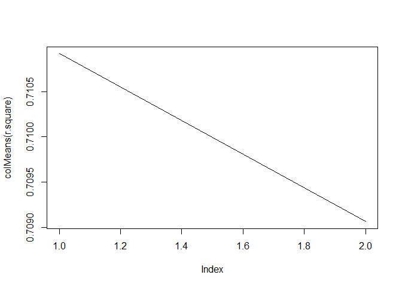

port9
================
Yoo Ri Hwang
4/19/2022

# overview

K fold cross validation.

cross validation: resampling agian and agian to evaluate models
(especially machine laerning models) K: given data is splited into “k”
group

More specifically, the data is splited into training set Vs. test set.
In other words, it is splited and each splited data would be either
exploration data or confiramiton data.

# practice

## load packages

``` r
library(psych)  
library(tidyverse)  
```

    ## -- Attaching packages --------------------------------------- tidyverse 1.3.1 --

    ## v ggplot2 3.3.5     v purrr   0.3.4
    ## v tibble  3.1.4     v dplyr   1.0.8
    ## v tidyr   1.2.0     v stringr 1.4.0
    ## v readr   2.0.1     v forcats 0.5.1

    ## Warning: package 'tidyr' was built under R version 4.1.3

    ## Warning: package 'dplyr' was built under R version 4.1.3

    ## -- Conflicts ------------------------------------------ tidyverse_conflicts() --
    ## x ggplot2::%+%()   masks psych::%+%()
    ## x ggplot2::alpha() masks psych::alpha()
    ## x dplyr::filter()  masks stats::filter()
    ## x dplyr::lag()     masks stats::lag()

``` r
library(car)
```

    ## Loading required package: carData

    ## 
    ## Attaching package: 'car'

    ## The following object is masked from 'package:dplyr':
    ## 
    ##     recode

    ## The following object is masked from 'package:purrr':
    ## 
    ##     some

    ## The following object is masked from 'package:psych':
    ## 
    ##     logit

## load data

``` r
filepath <- "https://quantdev.ssri.psu.edu/sites/qdev/files/apexpos.csv"
dat <- read.csv(file=url(filepath),header=TRUE)

summary(dat)
```

    ##        id            apexpos           fsiq7       
    ##  Min.   :  1.00   Min.   : 0.000   Min.   : 31.00  
    ##  1st Qu.: 80.25   1st Qu.: 5.325   1st Qu.: 53.25  
    ##  Median :159.50   Median :10.700   Median : 76.00  
    ##  Mean   :160.29   Mean   :11.279   Mean   : 74.65  
    ##  3rd Qu.:240.75   3rd Qu.:16.800   3rd Qu.: 95.00  
    ##  Max.   :320.00   Max.   :24.900   Max.   :126.00

## Predicted model 1

yi = beta0*1 + beta1*xi

``` r
lm <- lm(fsiq7 ~ 1 + apexpos , data=dat, na.action=na.exclude)
summary(lm)
```

    ## 
    ## Call:
    ## lm(formula = fsiq7 ~ 1 + apexpos, data = dat, na.action = na.exclude)
    ## 
    ## Residuals:
    ##     Min      1Q  Median      3Q     Max 
    ## -33.108  -8.790  -0.232   8.004  39.749 
    ## 
    ## Coefficients:
    ##             Estimate Std. Error t value Pr(>|t|)    
    ## (Intercept) 107.4337     1.4289   75.19   <2e-16 ***
    ## apexpos      -2.9068     0.1079  -26.93   <2e-16 ***
    ## ---
    ## Signif. codes:  0 '***' 0.001 '**' 0.01 '*' 0.05 '.' 0.1 ' ' 1
    ## 
    ## Residual standard error: 13.25 on 312 degrees of freedom
    ## Multiple R-squared:  0.6992, Adjusted R-squared:  0.6982 
    ## F-statistic: 725.1 on 1 and 312 DF,  p-value: < 2.2e-16

## predicted model 2

yi = beta0 *1 + beta1*xi + beta2\*xi^2 + ei

it is quadratic model.

``` r
dat$apexpos_sq <- dat$apexpos^2

lm2 <- lm(fsiq7 ~ 1 + apexpos + apexpos_sq, data=dat, na.action=na.exclude)
summary(lm2)
```

    ## 
    ## Call:
    ## lm(formula = fsiq7 ~ 1 + apexpos + apexpos_sq, data = dat, na.action = na.exclude)
    ## 
    ## Residuals:
    ##     Min      1Q  Median      3Q     Max 
    ## -33.939  -8.731  -0.351   7.826  38.618 
    ## 
    ## Coefficients:
    ##              Estimate Std. Error t value Pr(>|t|)    
    ## (Intercept) 108.47508    2.05289  52.840  < 2e-16 ***
    ## apexpos      -3.17979    0.40087  -7.932 3.91e-14 ***
    ## apexpos_sq    0.01163    0.01644   0.707     0.48    
    ## ---
    ## Signif. codes:  0 '***' 0.001 '**' 0.01 '*' 0.05 '.' 0.1 ' ' 1
    ## 
    ## Residual standard error: 13.26 on 311 degrees of freedom
    ## Multiple R-squared:  0.6997, Adjusted R-squared:  0.6977 
    ## F-statistic: 362.2 on 2 and 311 DF,  p-value: < 2.2e-16

# K-fold cross vailidation ( I will choose 10 fold)

``` r
# shuffling data
dat.shuffled<-dat[sample(nrow(dat)),]

# set k
k<-10

# creat k folds-- equal size each

folds<-cut(seq(1,nrow(dat.shuffled)),breaks=k, labels =F)
folds
```

    ##   [1]  1  1  1  1  1  1  1  1  1  1  1  1  1  1  1  1  1  1  1  1  1  1  1  1  1
    ##  [26]  1  1  1  1  1  1  1  2  2  2  2  2  2  2  2  2  2  2  2  2  2  2  2  2  2
    ##  [51]  2  2  2  2  2  2  2  2  2  2  2  2  2  3  3  3  3  3  3  3  3  3  3  3  3
    ##  [76]  3  3  3  3  3  3  3  3  3  3  3  3  3  3  3  3  3  3  3  4  4  4  4  4  4
    ## [101]  4  4  4  4  4  4  4  4  4  4  4  4  4  4  4  4  4  4  4  4  4  4  4  4  4
    ## [126]  4  5  5  5  5  5  5  5  5  5  5  5  5  5  5  5  5  5  5  5  5  5  5  5  5
    ## [151]  5  5  5  5  5  5  5  6  6  6  6  6  6  6  6  6  6  6  6  6  6  6  6  6  6
    ## [176]  6  6  6  6  6  6  6  6  6  6  6  6  6  7  7  7  7  7  7  7  7  7  7  7  7
    ## [201]  7  7  7  7  7  7  7  7  7  7  7  7  7  7  7  7  7  7  7  7  8  8  8  8  8
    ## [226]  8  8  8  8  8  8  8  8  8  8  8  8  8  8  8  8  8  8  8  8  8  8  8  8  8
    ## [251]  8  9  9  9  9  9  9  9  9  9  9  9  9  9  9  9  9  9  9  9  9  9  9  9  9
    ## [276]  9  9  9  9  9  9  9 10 10 10 10 10 10 10 10 10 10 10 10 10 10 10 10 10 10
    ## [301] 10 10 10 10 10 10 10 10 10 10 10 10 10 10

``` r
order <- 2 # we only have two models, with one is not quadric, and one is quadric.
k<-10
```

### practice nested for function and unfamiliar function

``` r
# nested for
for (k in 1:10){
  
  for(i in 1:3){
    print(paste("k=",k,"i=",i)) 
  }
  
  
}
```

    ## [1] "k= 1 i= 1"
    ## [1] "k= 1 i= 2"
    ## [1] "k= 1 i= 3"
    ## [1] "k= 2 i= 1"
    ## [1] "k= 2 i= 2"
    ## [1] "k= 2 i= 3"
    ## [1] "k= 3 i= 1"
    ## [1] "k= 3 i= 2"
    ## [1] "k= 3 i= 3"
    ## [1] "k= 4 i= 1"
    ## [1] "k= 4 i= 2"
    ## [1] "k= 4 i= 3"
    ## [1] "k= 5 i= 1"
    ## [1] "k= 5 i= 2"
    ## [1] "k= 5 i= 3"
    ## [1] "k= 6 i= 1"
    ## [1] "k= 6 i= 2"
    ## [1] "k= 6 i= 3"
    ## [1] "k= 7 i= 1"
    ## [1] "k= 7 i= 2"
    ## [1] "k= 7 i= 3"
    ## [1] "k= 8 i= 1"
    ## [1] "k= 8 i= 2"
    ## [1] "k= 8 i= 3"
    ## [1] "k= 9 i= 1"
    ## [1] "k= 9 i= 2"
    ## [1] "k= 9 i= 3"
    ## [1] "k= 10 i= 1"
    ## [1] "k= 10 i= 2"
    ## [1] "k= 10 i= 3"

``` r
  #which()
  
  which(dat$id==10)
```

    ## [1] 10

``` r
# create an empty holder

k<-10
order<-2
r.square<- matrix(,nrow=k,ncol=order)

# k-fold validation 
for (i in 1:k){
  
  # sgmnent data by which function, and i would be 1, 2, 3, ...10 
  testIndexes<- which(folds==i, arr.ind=T)
  testData <- dat.shuffled[testIndexes,] # this will test data set
  trainData <- dat.shuffled[-testIndexes,] # except the test dataset, it will be training data set
  
   for ( j in 1:order){
     fit.train = lm(fsiq7 ~ poly(apexpos,j), data=trainData)
      fit.test = predict(fit.train, newdata = testData)
      r.square[i,j] = cor(fit.test, testData$fsiq7, use='complete')^2
   }
}

#Averinging fit at each order

fits.kfold<-colMeans(r.square)
plot(colMeans(r.square),type='l') # l for lines 
```

<!-- -->

Based on this graph, 1 is beter than 2 (quadric model)

## Apply this to new data

### load new data

``` r
filepath <- "https://quantdev.ssri.psu.edu/sites/qdev/files/apexpos_test.csv"
dat.test <- read.csv(file=url(filepath),header=TRUE)
```

``` r
newdata.predict<-predict(lm, newdata=dat.test)
cor(dat.test$fsiq7, newdata.predict)^2
```

    ## [1] 0.6868776
